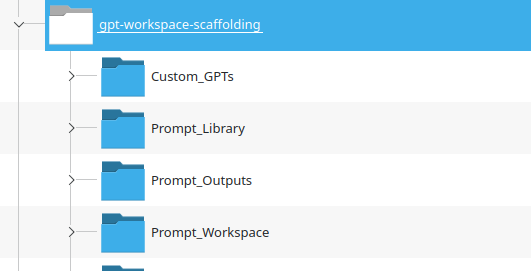
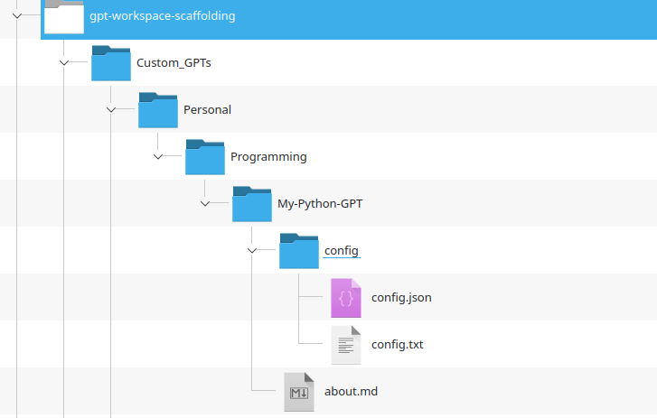
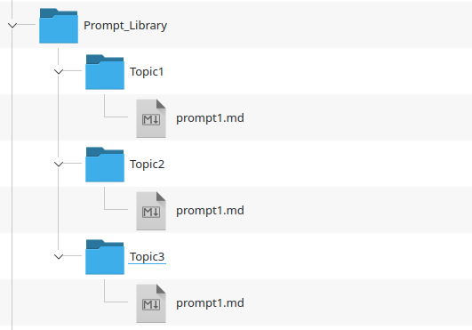
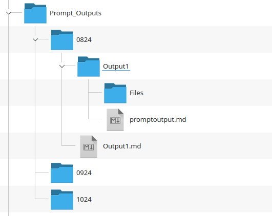
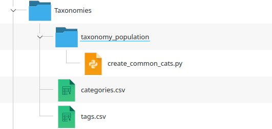

# GPT Workspace Folder Structure / Scaffold: Notes

## Screenshots / Folder Structure

Core folders:

Inventory of custom GPTs:

Basic prompt library:

Prompt outputs:

Taxonomies:

---

# Root Level Folders

## Custom GPTs - Core Folder 1

At the root level is a `Custom_GPTs` folder.

This is designed to be the folder that houses your record/inventory of custom GPTs which is expected to grow over time. 

It makes sense (in my opinion) to organise this folder **thematically**. 

I have provided subfolders at the first root level for `work` and `personal` for those who wish to use the workspace for both professional and personal use. Of course, this structure could be employed for the other "modules" as well.

### Version Control For Configuration Changes

You will probably want to periodically update and improve your custom GPTs as you figure out what's working (and what's not).

Under `config` you can create folders like `current` and `oldversions`.

And then store old versions under `oldversions.`

To do this, you should create a version control system. This could be noted as a field in the `about.me` document for each GPT.

---

## Prompt Library - Core Folder 2

This folder is designed to store a prompt library.

A prompt library is where you store your best prompts.  

It makes sense (in my opinion) to organise this folder **thematically**. 

Hence, I have provided a few demonstration subfolders to group prompts into themes.

---

## Prompt Workspace - Core Folder 3

There are a few hallmarks that distinguish professional from casual use of GPTs, at least at the time of writing.

I suggest some of these to be:

- Prompt engineering: Prompts are carefully constructed
- Prompt testing: Prompts are A/B tested and iteratively improved

The division of prompts into a `library` and `workspace` is intended to reflect this workflow:

- You work on developing prompts in the workspace
- You run them
- You record the output
- You commit the most successful prompts into the prompt library

This is 'my' workflow and others might wish to have a different one, like recording every single prompt run.

The `Prompt_Workspace` folder is where you might wish to do your prompt engineering. If you'd like to work on prompts as a team (via Github etc - fun idea) you might also wish to add subfolders for individual team members (and then merge into a common "ready for prompting" folder).

A very simple directory structure is populated to show this setup.

One tip: avoid deleting data for no good reason!

The `abandoned` subfolder is there to store prompt ideas that didn't work out (you can later move them into the archive.)

The `Prompt_Ideas` folder stores your rough ideas for prompting (these could be human or GPT-generated).

---

## System

The `system` folder houses some folders intended to keep the overall workspace organised. 

## Taxonomies

As mentioned in the `readme` a relational database offers many advantages over a simpler folder-based structure like this.

To make a subsequent migration easier (or for other reasons) you may wish to develop reuseable taxonomies to categorise prompts.

### Archived

A subfolder for storing material that is no longer needed without deleting it. 

This might be custom GPTs that you're no longer using, for instance. 

You may prefer to index them here rather than delete them from the filesystem.

### First Entry

A personal preference of mine is to create a `first entry` folder where I put things that I need to reorganise later. 